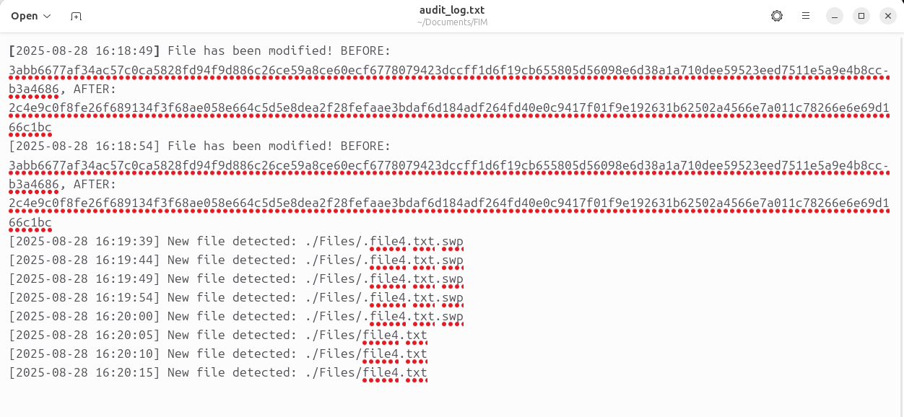

# FIM-File-Integrity-Monitor-
A high level implementation of a FIM which stands for file integrity monitor. 
#
The CIA triad in information securty stands for Confidentiality, Integrity, and Availablity. These are the core princables that guide cybersecurity practices and policies. 

* **Confidentiality** ensures that sensitive information is accessed only by authorised indivituals.
* **Integrity** (this projects focus) involves maintaining the accuracy and consistency of the data across its lifecycle, ensuring that it is not altered or tampered with by unauthorized parties.
* **Availablity** ensures that information and resources are availble to authorized users when needed.


**File Integrity Monitor (FIM)** is an important tool in cybersecurity that verifies the integrity of files and systems to detect unauthorized changes, potential threats, or misconfigurations. 

This project is a basic but functional Python implementation of a FIM. It calculates and stores cryptographic hashes of files, then periodically checks for:

- File modifications
- File deletions
- New (unexpected) file creations

All changes are logged with timestamps for audit purposes.

---
## Instalation
1. Clone the repository:

   ```bash
   git clone https://github.com/aishamohamed/FIM-File-Integrity-Monitor-.git
   cd FIM
2. No external dependencies are required. The script uses only Python's standard library.

---
## Usage 

Place the files you want to monitor inside the Files/ directory.

Run the script:

    ```bash
    python3 FIM.py

Choose one of the following options:

A – Generate a new baseline (hash of all files in the directory)

B – Start monitoring using the existing baseline

Detected changes are printed to the terminal and also logged in audit_log.txt.

---
## Features
* SHA512 hashing for strong integrity validation

* Detects:

  * File modifications

  * File deletions

  * New file creations

* Logs all events with timestamp

* Lightweight, using only Python standard libraries

* Terminal-based
---
## File Structure
-
   ```bash
   File-Integrity-Monitor-/
   ├── Files/              
   ├── FIM.py              
   ├── baseline.txt        
   ├── audit_log.txt       
   └── README.md
 
---
## Live Monitoring Example
* File Modified: Shows the BEFORE and AFTER SHA-512 hashes.

* New File Detected: Detects new files
  


## Logged Audit Output


* Timestamps make it easy to track when changes occurred.

* Useful for post-event analysis or long-term monitoring.


